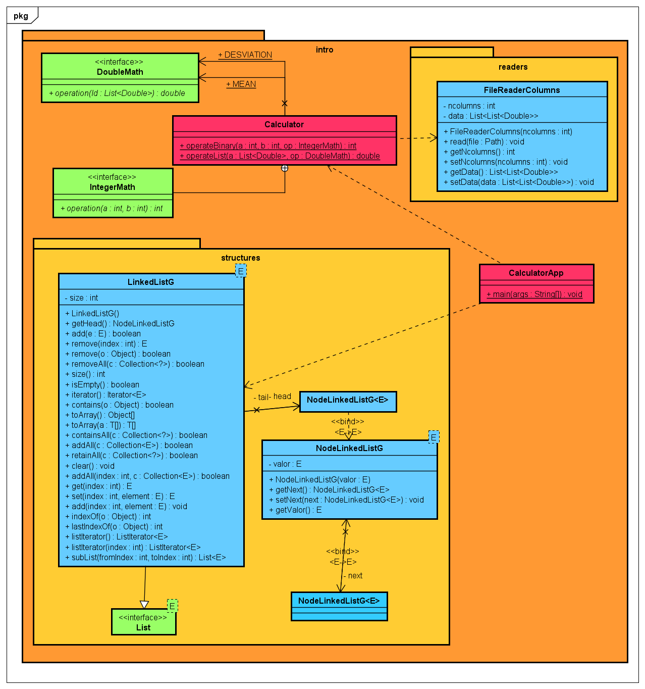
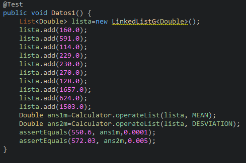
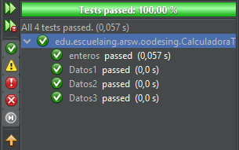

# Introduccion a MVN GIT y GitHub ( Media y Desviación Estándar)

## Autor

* **J. Eduardo Arias Barrera** - [AriasAEnima](https://github.com/AriasAEnima)

# Documento:
## [(Click Aqui)](informe)

### Prerrequisitos

Java JDK 1.8, Maven y Git.

* [JAVA JDK 8](http://www.oracle.com/technetwork/java/javase/overview/index.html) - Version de Java
* [Maven](https://maven.apache.org/) - Maven
* [JUnit 3.8.1](https://mvnrepository.com/artifact/junit/junit/3.8.1) - Para Pruebas


## Para empezar

Se debe ejecutar en la carpeta que queremos que esté
```
> git clone https://github.com/AriasAEnima/Intro-MVN-GIT-Desviacion-Promedio.git
```
### Instalación

Primero ejecutamos maven en la carpeta raíz, esto compilara el aplicativo

```
> mvn package
```


## Ejecución:

Para correr la calculadora con los datos deseados , en este caso tomara dos columnas de datos puestas en un archivo txt que está en el directorio raíz:
```

>java -cp target/Intro-Mvn-Git-Desv-Prom-1.0-SNAPSHOT.jar
edu.escuelaing.arem.intro.CalculatorApp prueba.txt
```


## Diseño Utilizado




## Pruebas por JUnit:

Estas se ejecutaran al hacer mvn package






## Documentación:

Se encuentra en la carpeta y se puede generar
```
> cd src/resources/javadoc
```


## Licencia

This project is licensed under the MIT License  - see the [LICENSE](LICENSE) file for details
